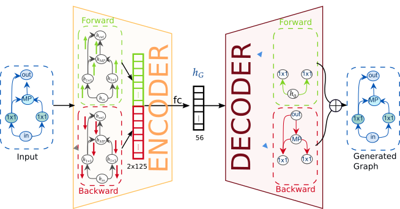

{{ page.authors }}

## Abstract 

>Neural architecture search (NAS) has recently been addressed from various directions, including discrete, sampling-based methods and efficient differentiable approaches. While the former are notoriously expensive, the latter suffer from imposing strong constraints on the search space. Architecture optimization from a learned embedding space for example through graph neural network based variational autoencoders builds a middle ground and leverages advantages from both sides. Such approaches have recently shown good performance on several benchmarks. Yet, their stability and predictive power heavily depends on their capacity to reconstruct networks from the embedding space. In this paper, we propose a two-sided variational graph autoencoder, which allows to smoothly encode and accurately reconstruct neural architectures from various search spaces. We evaluate the proposed approach on neural architectures defined by the ENAS approach, the NAS-Bench-101 and the NAS-Bench-201 search space and show that our smooth embedding space allows to directly extrapolate the performance prediction to architectures outside the seen domain (e.g. with more operations). Thus, it facilitates to predict good network architectures even without expensive Bayesian optimization or reinforcement learning.

## Resources

<a href=" {{ page.paperurl }} ">[pdf]</a> <a href=" {{ page.arxiv }} ">[arxiv]</a> <a href=" {{ page.code }} ">[github]</a> <a href=" {{ page.video }} ">[video]</a> <a href=" {{ page.poster }} ">[video]</a>

## Bibtex 

      @inproceedings{Lukasik2021svge,
         author={Lukasik, Jovita and Friede, David and Zela, Arber and Hutter, Frank and Keuper, Margret},
          booktitle={2021 International Joint Conference on Neural Networks (IJCNN)}, 
          title={Smooth Variational Graph Embeddings for Efficient Neural Architecture Search}, 
          year={2021}}

