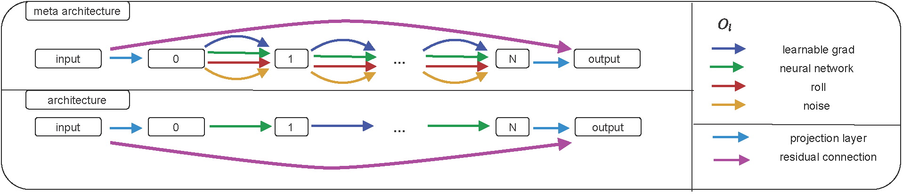

{{ page.authors }}

## Abstract 

>Differentiable architecture search (DARTS) is a widely researched tool for neural architecture search, due to its promising results for image classification. The main benefit of DARTS is the effectiveness achieved through the weight-sharing one-shot paradigm, which allows efficient architecture search.
In this work, we investigate DARTS in a systematic case study of inverse problems, which allows us to analyze these potential benefits in a controlled manner. 
Although we demonstrate that the success of DARTS can be extended from classification to reconstruction, our experiments yield a fundamental difficulty in the evaluation of DARTS-based methods: The results show a large variance in all test cases and the weight-sharing performance of the architecture found during training does not always reflect its final performance. 
We conclude the necessity to 1) report the results of any DARTS-based methods from several runs along with its underlying performance statistics and 2) show the correlation between the training and final architecture performance.
>
## Resources

<a href=" {{ page.paperurl }} ">[pdf]</a> <a href=" {{ page.arxiv }} ">[arxiv]</a> <a href=" {{ page.code }} ">[github]</a> <a href=" {{ page.video }} ">[video]</a> <a href=" {{ page.poster }} ">[video]</a>

## Bibtex 

      @inproceedings{
        geiping2021darts,
        title={{DARTS} for Inverse Problems: a Study on Stability},
        author={Jonas Geiping and Jovita Lukasik and Margret Keuper and Michael Moeller},
        booktitle={NeurIPS 2021 Workshop on Deep Learning and Inverse Problems},
        year={2021},
        url={https://openreview.net/forum?id=ty5XCitJfLA}
        }

