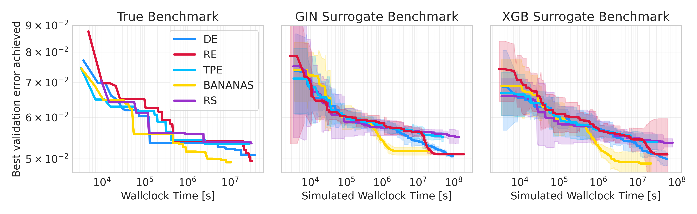

{{ page.authors }}

## Abstract 

>The most significant barrier to the advancement of Neural Architecture Search (NAS) is its demand for large computational resources, which hinders scientifically sound empirical evaluations of NAS methods. Tabular NAS benchmarks have alleviated this problem substantially, making it possible to properly evaluate NAS methods in seconds on commodity machines. However, an unintended consequence of tabular NAS benchmarks has been a focus on extremely small architectural search spaces since their construction relies on exhaustive evaluations of the space. This leads to unrealistic results that do not transfer to larger spaces. To overcome this fundamental limitation, we propose a methodology to create cheap NAS surrogate benchmarks for arbitrary search spaces. We exemplify this approach by creating surrogate NAS benchmarks on the existing tabular NAS-Bench-101 and on two widely used NAS search spaces with up to 10^21
 architectures (10^13 times larger than any previous tabular NAS benchmark). We show that surrogate NAS benchmarks can model the true performance of architectures better than tabular benchmarks (at a small fraction of the cost), that they lead to faithful estimates of how well different NAS methods work on the original non-surrogate benchmark, and that they can generate new scientific insight. We open-source all our code and believe that surrogate NAS benchmarks are an indispensable tool to extend scientifically sound work on NAS to large and exciting search spaces.

## Resources

<a href=" {{ page.paperurl }} ">[pdf]</a> <a href=" {{ page.arxiv }} ">[arxiv]</a> <a href=" {{ page.code }} ">[github]</a> <a href=" {{ page.video }} ">[video]</a> <a href=" {{ page.poster }} ">[video]</a>

## Bibtex 

      @inproceedings{
	zela2022surrogate,
	title={Surrogate {NAS} Benchmarks: Going Beyond the Limited Search Spaces of Tabular {NAS} Benchmarks},
	author={Arber Zela and Julien Niklas Siems and Lucas Zimmer and Jovita Lukasik and Margret Keuper and Frank Hutter},
	booktitle={International Conference on Learning Representations},
	year={2022},
	url={https://openreview.net/forum?id=OnpFa95RVqs}
	}

