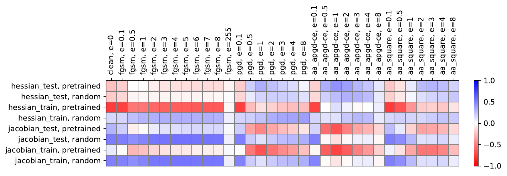

{{ page.authors }}

## Abstract 

> Deep learning models have proven to be successful in a wide range of machine learning tasks. Yet, they are often highly sensitive to perturbations on the input data which can lead to incorrect decisions with high confidence, hampering their deployment for practical use-cases. Thus, finding architectures that are (more) robust against perturbations has received much attention in recent years. Just like the search for well-performing architectures in terms of clean accuracy, this usually involves a tedious trial-and-error process with one additional challenge: the evaluation of a network's robustness is significantly more expensive than its evaluation for clean accuracy. Thus, the aim of this paper is to facilitate better streamlined research on architectural design choices with respect to their impact on robustness as well as, for example, the evaluation of surrogate measures for robustness. We therefore borrow one of the most commonly considered search spaces for neural architecture search for image classification, NAS-Bench-201, which contains a manageable size of 6466 non-isomorphic network designs. We evaluate all these networks on a range of common adversarial attacks and corruption types and introduce a database on neural architecture design and robustness evaluations. We further present three exemplary use cases of this dataset, in which we (i) benchmark robustness measurements based on Jacobian and Hessian matrices for their robustness predictability, (ii) perform neural architecture search on robust accuracies, and (iii) provide an initial analysis of how architectural design choices affect robustness. We find that carefully crafting the topology of a network can have substantial impact on its robustness, where networks with the same parameter count range in mean adversarial robust accuracy from 20%-41%.
## Resources

<a href=" {{ page.paperurl }} ">[pdf]</a> <a href=" {{ page.arxiv }} ">[arxiv]</a> <a href=" {{ page.code }} ">[github]</a> <a href=" {{ page.video }} ">[video]</a> <a href=" {{ page.poster }} ">[video]</a>

## Bibtex 

      @inproceedings{jung2023neural,
	title={Neural Architecture Design and Robustness: A Dataset},
	author={Steffen Jung and Jovita Lukasik and Margret Keuper},
	booktitle={The Eleventh International Conference on Learning Representations },
	year={2023}}

