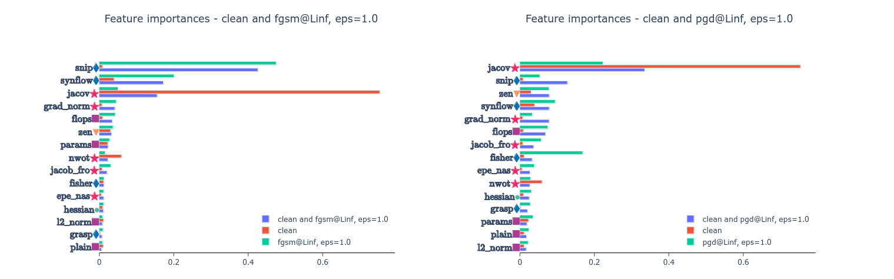

{{ page.authors }}

## Abstract 

> Zero-cost proxies are nowadays frequently studied and used to search for neural architectures. They show an impressive ability to predict the performance of architectures by making use of their untrained weights. These techniques allow for immense search speed-ups. So far the joint search for well-performing and robust architectures has received much less attention in the field of NAS. Therefore, the main focus of zero-cost proxies is the clean accuracy of architectures, whereas the model robustness should play an evenly important part. In this paper, we analyze the ability of common zero-cost proxies to serve as performance predictors for robustness in the popular NAS-Bench-201 search space. We are interested in the single prediction task for robustness and the joint multi-objective of clean and robust accuracy. We further analyze the feature importance of the proxies and show that predicting the robustness makes the prediction task from existing zero-cost proxies more challenging. As a result, the joint consideration of several proxies becomes necessary to predict a model’s robustness while the clean accuracy can be regressed from a single such feature.

## Resources

<a href=" {{ page.paperurl }} ">[pdf]</a> <a href=" {{ page.arxiv }} ">[arxiv]</a> <a href=" {{ page.code }} ">[github]</a> <a href=" {{ page.video }} ">[video]</a> <a href=" {{ page.poster }} ">[video]</a>

## Bibtex 

      @inproceedings{lukasik2023zcprobusntess,
	author={Lukasik, Jovita and Moeller, Michael and Keuper, Margret},
	title={An Evaluation of Zero-Cost Proxies - From Neural Architecture Performance Prediction to Model Robustness},
	booktitle={DAGM German Conference on Pattern Recognition},
	year={2023}}

