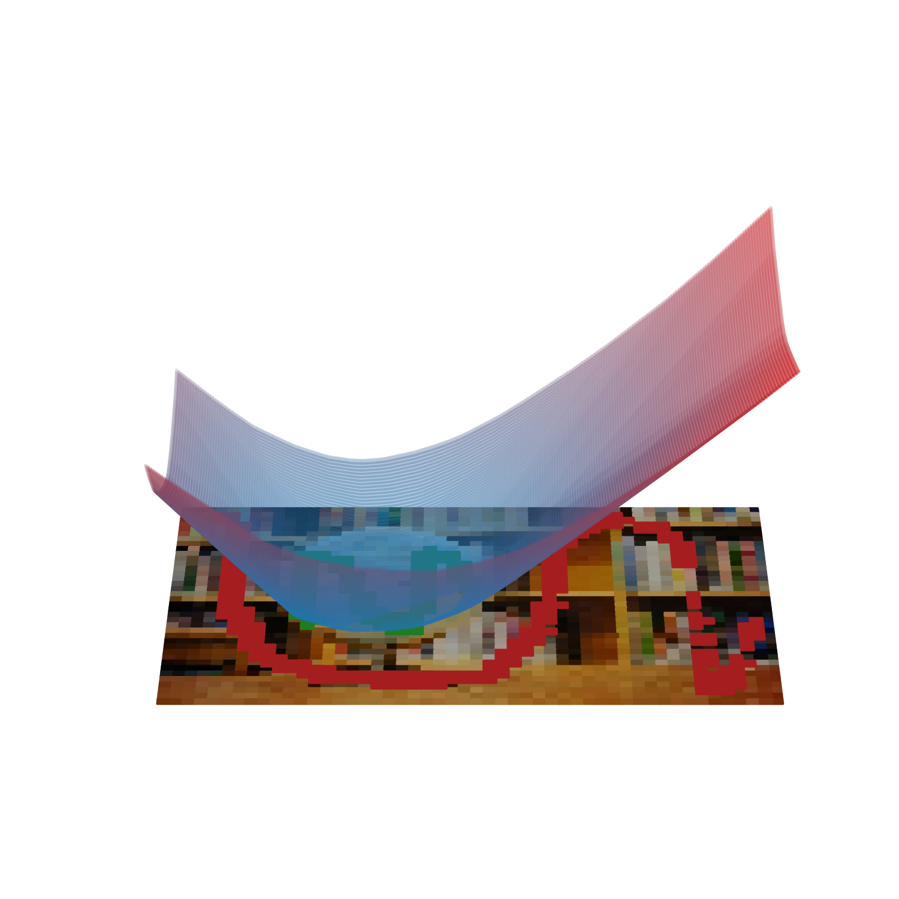

{{ page.authors }}

## Abstract 

> Image segmentation has greatly advanced over the past ten years. Yet, even the most recent techniques face difficulties producing good results in challenging situations, e.g., if training data are scarce, out-of-distribution examples need to be segmented, or if objects are occluded. In such situations, the inclusion of (geometric) constraints can improve the segmentation quality significantly. In this paper, we study the constraint of the segmented region being segmented convex. Unlike prior work that encourages such a property with computationally expensive penalties on segmentation masks represented explicitly on a grid of pixels, our work is the first to consider an implicit representation. Specifically, we represent the segmentation as a parameterized function that maps spatial coordinates to the likeliness of a pixel belonging to the fore- or background. This enables us to provably ensure the convexity of the segmented regions with the help of input convex neural networks. Numerical experiments demonstrate how to encourage explicit and implicit representations to match in order to benefit from the convexity constraints in several challenging segmentation scenarios.

## Resources

<a href=" {{ page.paperurl }} ">[pdf]</a> <a href=" {{ page.arxiv }} ">[arxiv]</a> <a href=" {{ page.code }} ">[github]</a> <a href=" {{ page.video }} ">[video]</a> <a href=" {{ page.poster }} ">[video]</a>

## Bibtex 

      @inproceedings{
	schneider2023implicit,
	title={Implicit Representations for Image Segmentation},
	author={Jan Philipp Schneider and Mishal Fatima and Jovita Lukasik and Andreas Kolb and Margret Keuper and Michael Moeller},
	booktitle={UniReps:  the First Workshop on Unifying Representations in Neural Models},
	year={2023}}

