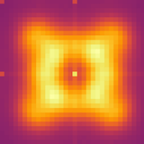

{{ page.authors }}

## Abstract 

> Neural networks tend to overfit the training distribution and perform poorly on out-of-distribution data. A conceptually simple solution lies in adversarial training, which introduces worst-case perturbations into the training data and thus improves model generalization to some extent. However, it is only one ingredient towards generally more robust models and requires knowledge about the potential attacks or inference time data corruptions during model training. This paper focuses on the native robustness of models that can learn robust behavior directly from conventional training data without out-of-distribution examples. To this end, we study the frequencies in learned convolution filters. Clean-trained models often prioritize high-frequency information, whereas adversarial training enforces models to shift the focus to low-frequency details during training. By mimicking this behavior through frequency regularization in learned convolution weights, we achieve improved native robustness to adversarial attacks, common corruptions, and other out-of-distribution tests. Additionally, this method leads to more favorable shifts in decision-making towards low-frequency information, such as shapes, which inherently aligns more closely with human vision.

## Resources

<a href=" {{ page.paperurl }} ">[pdf]</a> <a href=" {{ page.arxiv }} ">[arxiv]</a> <a href=" {{ page.code }} ">[github]</a> <a href=" {{ page.video }} ">[video]</a> <a href=" {{ page.poster }} ">[video]</a>

## Bibtex 

      @article{lukasik2023improving,
	title={Improving Native {CNN} Robustness with Filter Frequency Regularization},
	author={Jovita Lukasik and Paul Gavrikov and Janis Keuper and Margret Keuper},
	journal={Transactions on Machine Learning Research},
	issn={2835-8856},
	year={2023}}

