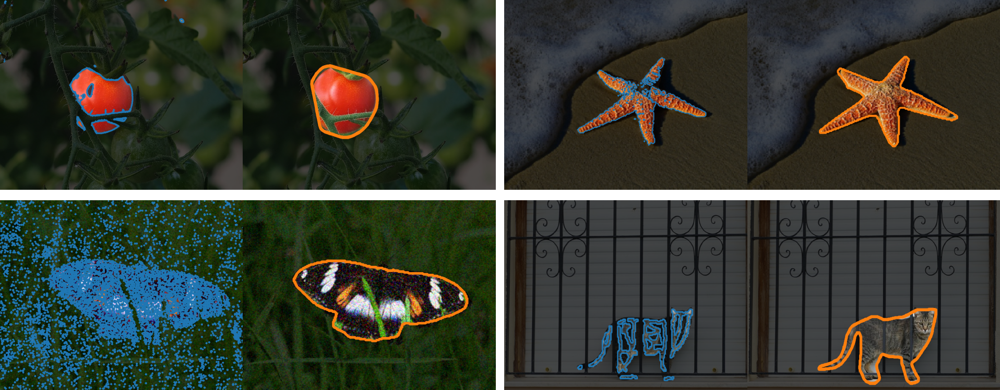

{{ page.authors }}

## Abstract 

> Implicit representations allow to use a parametric function that maps (spatial) coordinates to the value that is traditionally stored in each pixel, e.g. RGB values, instead of a discrete grid. This has recently proven quite advantageous as an internal representation for images or scenes for deep learning models. Yet, its potential to ensure certain properties of the solution has not yet been fully explored. In this work, we demonstrate that implicit representations are a powerful tool for enforcing a variety of different geometric constraints in image segmentation. While convexity, star-shape, path-connectedness, periodicity, or symmetry of the (spatial or space-time) region to be segmented are very challenging to enforce for pixel-wise discretizations, a suitable parametrization of an implicit representation, mapping spatial or spatio-temporal coordinates to the likeliness of a pixel belonging to the fore- or background, allows to provably ensure such constraints. Several numerical examples demonstrate that challenging segmentation scenarios can benefit from the inclusion of application-specific constraints, e.g. when occlusions prevent a faithful segmentation with classical approaches.

## Resources

<a href=" {{ page.paperurl }} ">[pdf]</a> <a href=" {{ page.arxiv }} ">[arxiv]</a> <a href=" {{ page.code }} ">[github]</a> <a href=" {{ page.video }} ">[video]</a> <a href=" {{ page.poster }} ">[video]</a>

## Bibtex 
	     
	@InProceedings{schneider24a,
	  title = 	 {Implicit Representations for Constrained Image Segmentation},
	  author =       {Schneider, Jan Philipp and Fatima, Mishal and Lukasik, Jovita and Kolb, Andreas and Keuper, Margret and Moeller, Michael},
	  booktitle = 	 {Proceedings of the 41st International Conference on Machine Learning},
	  year = 	 {2024}}

