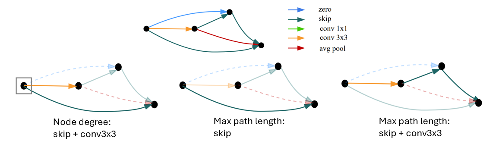

{{ page.authors }}

## Abstract 

> Performance prediction has been a key part of the neural architecture search (NAS) process, allowing to speed up NAS algorithms by avoiding resource-consuming network training. Although many performance predictors correlate well with ground truth performance, they require training data in the form of trained networks. Recently, zero-cost proxies have been proposed as an efficient method to estimate network performance without any training. However, they are still poorly understood, exhibit biases with network properties, and their performance is limited. Inspired by the drawbacks of zero-cost proxies, we propose neural graph features (GRAF), simple to compute properties of architectural graphs. GRAF offers fast and interpretable performance prediction while outperforming zero-cost proxies and other common encodings. In combination with other zero-cost proxies, GRAF outperforms most existing performance predictors at a fraction of the cost.

## Resources

<a href=" {{ page.paperurl }} ">[pdf]</a> <a href=" {{ page.arxiv }} ">[arxiv]</a> <a href=" {{ page.code }} ">[github]</a> <a href=" {{ page.video }} ">[video]</a> <a href=" {{ page.poster }} ">[video]</a>

## Bibtex 
	     

	@InProceedings{kadlecova24a,
	  title = 	 {Surprisingly Strong Performance Prediction with Neural Graph Features},
	  author =       {Kadlecov\'{a}, Gabriela and Lukasik, Jovita and Pil\'{a}t, Martin and Vidnerov\'{a}, Petra and Safari, Mahmoud and Neruda, Roman and Hutter, Frank},
	  booktitle = 	 {Proceedings of the 41st International Conference on Machine Learning},
	  year = 	 {2024}}

