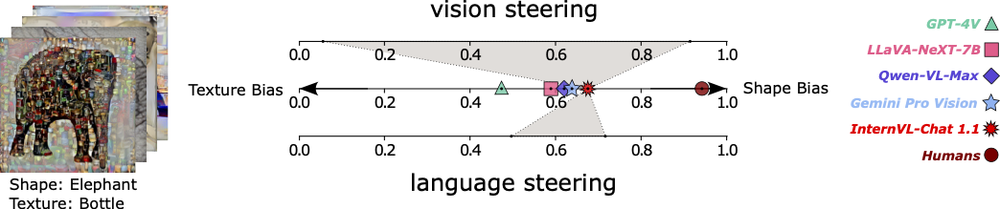

{{ page.authors }}

## Abstract 

Unlike traditional vision-only models, vision language models (VLMs) offer an intuitive way to access visual content through language prompting by combining a large language model (LLM) with a vision encoder. However, both the LLM and the vision encoder come with their own set of biases, cue preferences, and shortcuts, which have been rigorously studied in uni-modal models. A timely question is how such (potentially misaligned) biases and cue preferences behave under multi-modal fusion in VLMs. As a first step towards a better understanding, we investigate a particularly well-studied vision-only bias - the texture vs. shape bias and the dominance of local over global information. As expected, we find that VLMs inherit this bias to some extent from their vision encoders. Surprisingly, the multi-modality alone proves to have important effects on the model behavior, i.e., the joint training and the language querying change the way visual cues are processed. While this direct impact of language-informed training on a model's visual perception is intriguing, it raises further questions on our ability to actively steer a model's output so that its prediction is based on particular visual cues of the user's choice. Interestingly, VLMs have an inherent tendency to recognize objects based on shape information, which is different from what a plain vision encoder would do. Further active steering towards shape-based classifications through language prompts is however limited. In contrast, active VLM steering towards texture-based decisions through simple natural language prompts is often more successful.

## Resources

<a href=" {{ page.paperurl }} ">[pdf]</a> <a href=" {{ page.arxiv }} ">[arxiv]</a> <a href=" {{ page.code }} ">[github]</a> <a href=" {{ page.video }} ">[video]</a> <a href=" {{ page.poster }} ">[video]</a>

## Bibtex 
 
	@inproceedings{gavrikov2025can,
      title={Can We Talk Models Into Seeing the World Differently?},
      author={Paul Gavrikov and Jovita Lukasik and Steffen Jung and Robert Geirhos and Muhammad Jehanzeb Mirza and Margret Keuper and Janis Keuper},
      booktitle={The Thirteenth International Conference on Learning Representations},
      year={2025},
      url={https://openreview.net/forum?id=iVMcYxTiVM}
}

