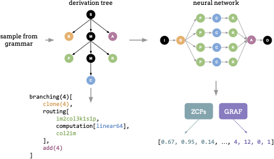

{{ page.authors }}

## Abstract 

Neural architecture search (NAS) faces a challenge in balancing the exploration of expressive, broad search spaces that enable architectural innovation with the need for efficient evaluation of architectures to effectively search such spaces. We investigate surrogate model training for improving search in highly expressive NAS search spaces based on context-free grammars. We show that i) surrogate models trained either using zero-cost-proxy metrics and neural graph features (GRAF) or by fine-tuning an off-the-shelf LM have high predictive power for the performance of architectures both within and across datasets, ii) these surrogates can be used to filter out bad architectures when searching on novel datasets, thereby significantly speeding up search and achieving better final performances, and iii) the surrogates can be further used directly as the search objective for huge speed-ups.

## Resources

<a href=" {{ page.paperurl }} ">[pdf]</a> <a href=" {{ page.arxiv }} ">[arxiv]</a> <a href=" {{ page.code }} ">[github]</a> <a href=" {{ page.video }} ">[video]</a> <a href=" {{ page.poster }} ">[video]</a>

## Bibtex 
 
@inproceedings{
qin2025transferrable,
title={Transferrable Surrogates in Expressive Neural Architecture Search Spaces},
author={Shiwen Qin and Gabriela Kadlecov{\'a} and Martin Pil{\'a}t and Shay B Cohen and Roman Neruda and Elliot J. Crowley and Jovita Lukasik and Linus Ericsson},
booktitle={AutoML 2025 Methods Track},
year={2025},
url={https://openreview.net/forum?id=TEup1DJTzd}
}

