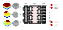

{{ page.authors }}

## Abstract 

>We introduce layered Quantum Architecture Search (layered-QAS), a strategy inspired by classical network morphism that designs Parametrised Quantum Circuit (PQC) architectures by progressively growing and adapting them. PQCs offer strong expressiveness with relatively few parameters, yet they lack standard architectural layers (e.g., convolution, attention) that encode inductive biases for a given learning task. To assess the effectiveness of our method, we focus on 3D point cloud classification as a challenging yet highly structured problem. Whereas prior work on this task has used PQCs only as feature extractors for classical classifiers, our approach uses the PQC as the main building block of the classification model. Simulations show that our layered-QAS mitigates barren plateau, outperforms quantum-adapted local and evolutionary QAS baselines, and achieves state-of-the-art results among PQC-based methods on the ModelNet dataset 

## Resources

<a href=" {{ page.paperurl }} ">[pdf]</a> <a href=" {{ page.arxiv }} ">[arxiv]</a> <a href=" {{ page.code }} ">[github]</a> <a href=" {{ page.video }} ">[video]</a> <a href=" {{ page.poster }} ">[video]</a>

## Bibtex 
    @inproceedings{
      meli2026layered,
      title={Layered Quantum Architecture Search for 3D Point Cloud Classification},
      author={Natacha Kuete Meli and Jovita Lukasik and Vladislav Golyanik and Michael Moeller},
      booktitle={Thirteenth International Conference on 3D Vision},
      year={2026},
      }
