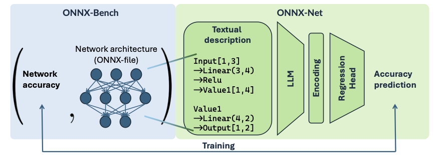

{{ page.authors }}

## Abstract 

>Neural architecture search (NAS) automates the design process of high-performing architectures, but remains bottlenecked by expensive performance evaluation. Most existing studies that achieve faster evaluation are mostly tied to cell-based search spaces and tailored graph encodings, limiting their flexibility and scalability when applied to more expressive search spaces. In this work, we aim to close the gap of individual search space restrictions and search space dependent network representations. We present ONNX-Bench, a benchmark consisting of a collection of neural networks in a unified format based on the Open Neural Network Exchange (ONNX) format. ONNX-Bench includes all open-source NAS-bench-based neural networks, resulting in a total size of k {} pairs. Using this benchmark, we create a shared neural network representation, ONNX-Net, able to represent any neural architecture using natural language descriptions acting as an input to a performance predictor. This text-based encoding can accommodate arbitrary layer types, operation parameters, and heterogeneous topologies, enabling a single surrogate to generalise across all neural architectures rather than being confined to cell-based search spaces. Experiments show strong zero-shot performance across disparate search spaces using only a small amount of pretraining samples, enabling the unprecedented ability to evaluate any neural network architecture instantly.

## Resources

<a href=" {{ page.paperurl }} ">[pdf]</a> <a href=" {{ page.arxiv }} ">[arxiv]</a> <a href=" {{ page.code }} ">[github]</a> <a href=" {{ page.video }} ">[video]</a> <a href=" {{ page.poster }} ">[video]</a>

## Bibtex 

    @inproceedings{
      qin2026onnxnet,
      title={{ONNX}-Net: Towards Universal Representations and Instant Performance Prediction for Neural Architectures},
      author={Shiwen Qin and Alexander Auras and Shay B Cohen and Elliot J. Crowley and Michael Moeller and Linus Ericsson and Jovita Lukasik},
      booktitle={AutoML 2026 Methods Track},
      year={2026}}
